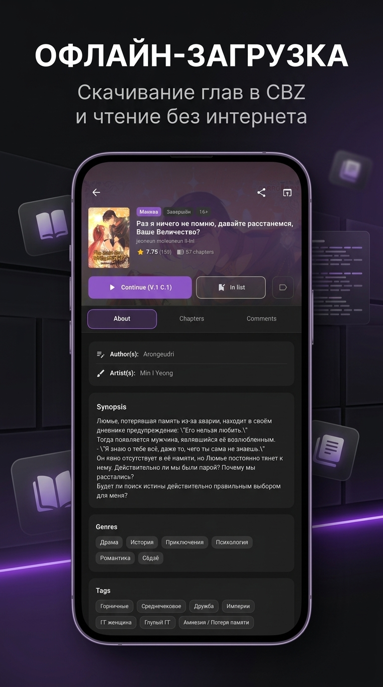

# MangaLoader

<p align="center">
  
</p>

<p align="center">
  <strong>A high-performance, cross-platform manga and comic reader & downloader built with Flutter and a native multi-threaded Rust core engine.</strong>
</p>

<p align="center">
  <a href="https://github.com/imsudoer/mangaloader/releases/latest"></a>
  <a href="https://github.com/imsudoer/mangaloader/releases/latest"></a>
  <a href="https://flutter.dev"></a>
  <a href="https://rustup.rs"></a>
  <a href="LICENSE"></a>
</p>

<p align="center">
  <a href="#screenshots">Screenshots</a> •
  <a href="#downloads">Downloads</a> •
  <a href="#features">Features</a> •
  <a href="#architecture">Architecture</a> •
  <a href="#building-from-source">Building from Source</a> •
  <a href="#keyboard-shortcuts-pc">Keyboard Shortcuts</a>
</p>

---

## Screenshots

<p align="center">
  
  
  
</p>

---

## Downloads

| Platform | Package | Notes |
| :--- | :--- | :--- |
| **Android (Universal)** | [`mangaloader-android-universal.apk`](https://github.com/imsudoer/mangaloader/releases/latest) | Works on all devices (ARM64, ARMv7, x86) |
| **Android (ARM64)** | [`mangaloader-android-arm64-v8a.apk`](https://github.com/imsudoer/mangaloader/releases/latest) | Optimized small size for modern phones |
| **Android (ARMv7)** | [`mangaloader-android-armeabi-v7a.apk`](https://github.com/imsudoer/mangaloader/releases/latest) | 32-bit legacy devices |
| **Windows** | [`mangaloader-windows-x64.zip`](https://github.com/imsudoer/mangaloader/releases/latest) | Portable archive (Windows 10/11 x64) |
| **Linux** | [`mangaloader-linux-x64.tar.gz`](https://github.com/imsudoer/mangaloader/releases/latest) | Linux x64 bundle |

> [!TIP]
> **Update Channels**: In the app settings (*Settings -> Updates*), you can switch between **Stable** (official releases) and **Beta/Dev** (rolling nightly builds with experimental features).

---

## Features

### Reader Engine
- **Continuous Webtoon Scrolling**: High-performance vertical strip scrolling for Webtoon/Manhwa without stuttering or memory leaks.
- **Paged Reading Modes**: Right-to-Left (Japanese Manga) and Left-to-Right reading modes.
- **Hands-Free Auto-Scroll**: Smooth adjustable-speed auto-scrolling with dedicated floating control bar.
- **Image Filters & Processing**:
  - Sharpening filters (Subtle / High) to restore clarity on compressed scans.
  - Dynamic white-border cropping and zoom controls.
  - Deep dark and AMOLED black themes for battery saving.
- **Smart Quick Navigation**: In-reader chapter selector and search dialog to quickly jump between chapters.

### Rust Download Engine & Offline CBZ Storage
- **Multi-Threaded Async Downloads**: Parallel chapter and page fetching using `tokio` and `reqwest` with automatic CDN fallback.
- **Standard CBZ Archive Storage**: Saves chapters into portable `.cbz` comic archives accessible offline and compatible with external readers.
- **Auto-Cleanup**: Optional automatic deletion of read chapters to save device storage.

### MangaLib Account Integration & Library
- **Integrated Secure Login**: Account authorization via built-in browser with automatic session cookie detection.
- **Full Library Sync**: Synchronizes bookmarks (*Reading*, *Plan to Read*, *Completed*, *Favorites*, *Dropped*).
- **Scale Optimized**: Fluid performance on large libraries (1000+ titles) with memory cache virtualization.

### Manga Recap & Statistics
- **Reading Analytics**: Tracks read chapters, pages, time spent reading, favorite genres, and reading streaks.
- **Recap Share Card**: Generates a shareable summary card of personal reading milestones.

---

## Architecture

```
+-------------------------------------------------------------+
|                      Flutter Frontend                       |
|        (UI, Riverpod State, GoRouter, Theme, Pages)         |
+------------------------------+------------------------------+
                               |  flutter_rust_bridge v2
+------------------------------v------------------------------+
|                      Rust Core Engine                       |
|  +--------------------+  +-------------------------------+  |
|  |  mangalib_client   |  |        download_engine        |  |
|  |  (Async HTTP, API) |  |   (Tokio Chunks, Concurrency) |  |
|  +--------------------+  +-------------------------------+  |
|  +--------------------+  +-------------------------------+  |
|  |     cbz_export     |  |            storage            |  |
|  |  (Zip, CBZ Reader) |  |    (SQLite Rusqlite, DB)      |  |
|  +--------------------+  +-------------------------------+  |
+-------------------------------------------------------------+
```

---

## Keyboard Shortcuts (PC)

| Key / Shortcut | Action |
| :--- | :--- |
| `Space` / `Down Arrow` / `J` | Scroll down / Next page |
| `Up Arrow` / `K` | Scroll up / Previous page |
| `Left Arrow` | Previous page (RTL mode) |
| `Right Arrow` | Next page (RTL mode) |
| `F` / `F11` | Toggle Fullscreen |
| `Escape` | Exit reader / Navigate back |
| `Double Click` | Toggle 2x Zoom |

---

## Building from Source

### Prerequisites
- [Flutter SDK](https://flutter.dev) (3.29+)
- [Rust Toolchain](https://rustup.rs) (stable)
- `cargo install flutter_rust_bridge_codegen --version 2.12.0`
- For Android: Android SDK, NDK (r26b+), and `cargo install cargo-ndk`
- For Linux: `clang, cmake, ninja-build, pkg-config, libgtk-3-dev, liblzma-dev`

### 1. Clone the repository
```bash
git clone https://github.com/imsudoer/mangaloader.git
cd mangaloader
```

### 2. Generate bridge bindings & fetch dependencies
```bash
flutter_rust_bridge_codegen generate
flutter pub get
```

### 3. Build for Desktop
```bash
# Windows x64
flutter build windows --release

# Linux x64
flutter build linux --release
```

### 4. Build for Android
```bash
# Universal APK (All ABIs)
flutter build apk --release

# Split APKs (per-architecture)
flutter build apk --release --split-per-abi
```

---

## License

This project is licensed under the GNU General Public License v3.0 - see the [LICENSE](LICENSE) file for details.
